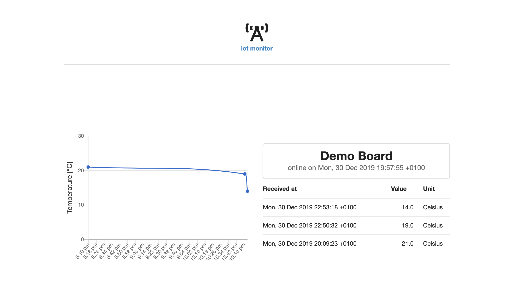
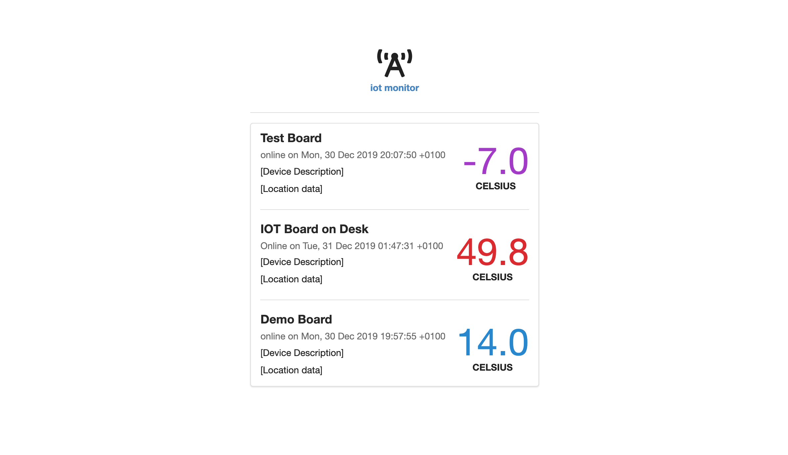

# README

Application for logging and displaying data from the [IOT_Board](https://github.com/lbrnmdev/iot_board) project.



##### Prerequisites

- Git
- Ruby [2.6.5](https://www.ruby-lang.org/en/news/2019/10/01/ruby-2-6-5-released/)
- [PostgreSQL](https://www.postgresql.org/docs/12/release-12-1.html)
- An MQTT Broker

##### 1. Check out the repository

```bash
git clone https://github.com/lbrnmdev/iot_monitor.git
cd iot_monitor
bundle install
```
##### 3. Create and setup the database

Make sure PostgreSQL is running, then run the following commands to create and setup the database.

```ruby
bundle exec rake db:create
bundle exec rake db:setup
```

##### 4. Start your MQTT Broker

App is configured to connect to 'localhost' on the default port of 1883. You can change this in `lib/my_mqtt.rb`

##### 5. Start the Rails server

```ruby
bundle exec rails s
```

Navigate to http://localhost:3000



### Roadmap
- Device description and location data
- Allow for devices to log readings of any sort, not just temperature
- Allow for data/commands to be sent to subscribed devices
- User accounts so monitored devices are exclusive to a particular user
